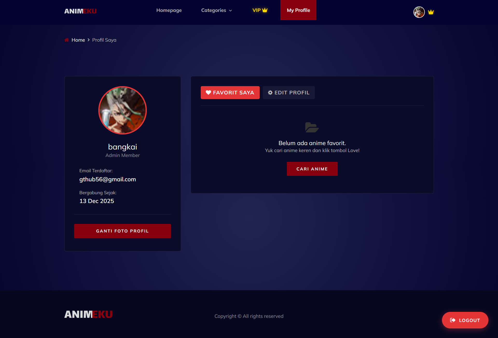
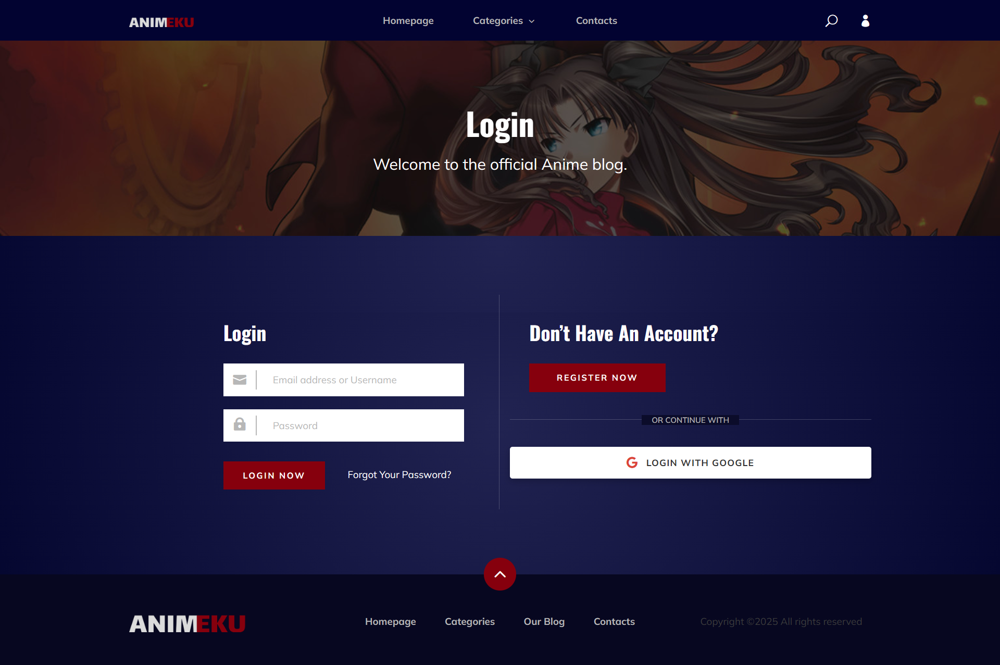
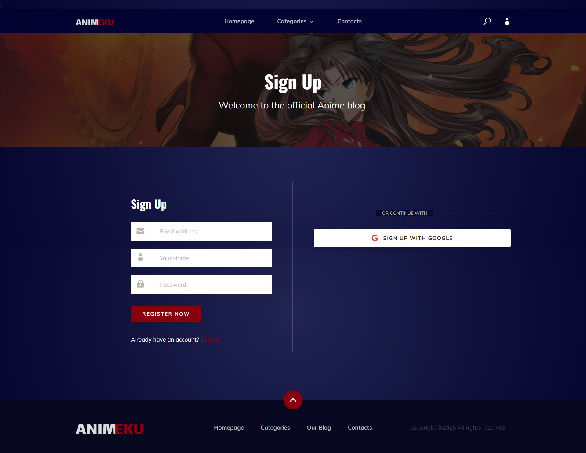
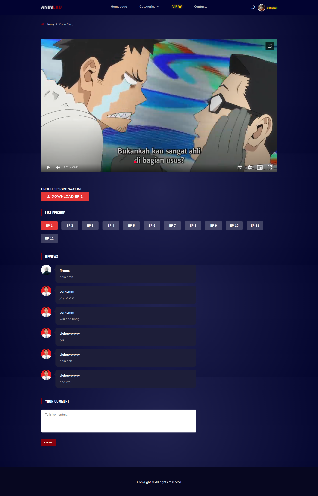
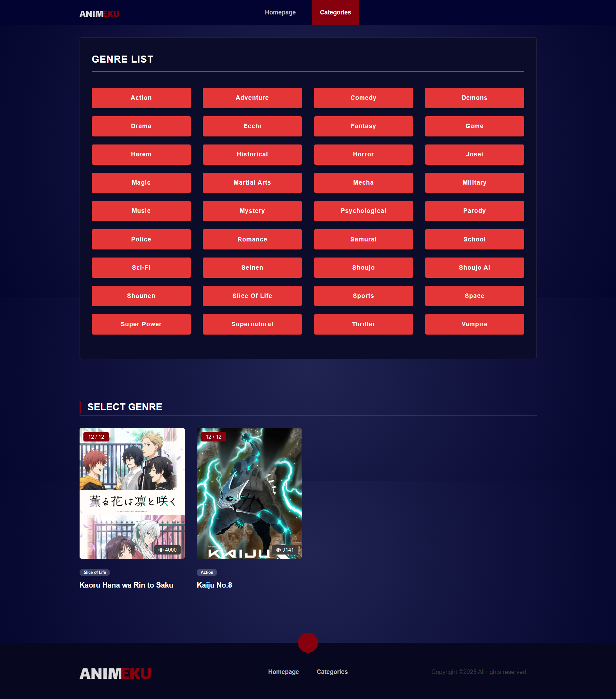

<p align="center">
    
</p>

# 🎌 Animeku - Website Streaming Anime

**Animeku** adalah platform web streaming anime yang modern dan responsif. Proyek ini dikembangkan menggunakan Framework **Laravel** untuk memenuhi tugas akhir mata kuliah **Pemrograman Berbasis Platform (PBP)**.

Aplikasi ini memudahkan pengguna untuk mencari, menonton, dan memberikan ulasan pada anime favorit mereka, serta dilengkapi sistem langganan VIP.

---

## 🚀 Fitur Unggulan

### 👤 Pengguna (User)
* **Streaming Lancar**: Menonton anime dengan player yang ringan.
* **Pencarian & Filter**: Cari anime berdasarkan Genre (Action, Romance, Isekai, dll).
* **Sistem Komentar**: Berdiskusi dengan pengguna lain di setiap episode.
* **Login Google**: Masuk dengan cepat menggunakan akun Google (OAuth).
* **Membership VIP**: Berlangganan untuk pengalaman bebas iklan & konten eksklusif.


### 🛡️ Admin Dashboard
* **Manajemen Anime**: Tambah, edit, dan hapus data anime & episode.
* **Manajemen Genre**: Mengatur kategori anime.
* **User Management**: Memantau daftar pengguna terdaftar.

---

## 🛠️ Teknologi yang Digunakan

| Kategori | Teknologi |
| :--- | :--- |
| **Backend** | Laravel (PHP Framework) |
| **Frontend** | Blade Template, Bootstrap 4, SASS |
| **Database** | MySQL |
| **Payment Gateway** | **Midtrans** (Otomatisasi pembayaran VIP) |
| **Authentication** | Laravel Auth & Google Client |
| **UI Library** | OwlCarousel, SlickNav, NiceSelect |

---

## ⚙️ Cara Instalasi (Localhost)

Ikuti langkah-langkah ini untuk menjalankan proyek di komputer lokal:

1.  **Clone Repository**
    ```bash
    git clone [https://github.com/dariusatera/Website-Streaming-Animeku.git](https://github.com/dariusatera/Website-Streaming-Animeku.git)
    cd Website-Streaming-Animeku
    ```

2.  **Install Dependencies**
    Pastikan Composer dan Node.js sudah terinstall.
    ```bash
    composer install
    npm install
    ```

3.  **Setup Environment (.env)**
    Duplikat file `.env.example` menjadi `.env`:
    ```bash
    cp .env.example .env
    ```
    Buka file `.env` dan atur konfigurasi database serta API Key:
    ```env
    DB_DATABASE=db_animeku
    DB_USERNAME=root
    DB_PASSWORD=

    # Konfigurasi Midtrans (Mode Sandbox/Production)
    MIDTRANS_SERVER_KEY=masukkan_server_key_anda
    MIDTRANS_CLIENT_KEY=masukkan_client_key_anda

    # Konfigurasi Google Login
    GOOGLE_CLIENT_ID=masukkan_client_id_anda
    GOOGLE_CLIENT_SECRET=masukkan_client_secret_anda
    ```

4.  **Generate Key & Database**
    ```bash
    php artisan key:generate
    php artisan migrate:fresh --seed
    ```

5.  **Jalankan Server**
    ```bash
    php artisan serve
    ```
    Buka browser dan akses: `http://localhost:8000`

---

## 👥 Tim Pengembang

Proyek ini dibuat oleh kelompok PBP Hosting:

* **Firmas** (Frontend & Database)
* **Hendra** (Web Hosting)
* **Hakim** (Backend Logic & Database)

---

## ⚠️ Catatan Keamanan

Untuk alasan keamanan, file `.env` yang berisi **API KEY (Midtrans/Google)** tidak disertakan dalam repository ini. Silakan buat akun di [Midtrans Dashboard](https://dashboard.midtrans.com/) dan [Google Cloud Console](https://console.cloud.google.com/) untuk mendapatkan key Anda sendiri.

---

## 📸 Screenshot Aplikasi

Berikut adalah beberapa tampilan antarmuka dari website Animeku.

| Halaman Utama (Home) | Profile |
| :---: | :---: |
|  |  |
| *Tampilan Beranda yang Responsif* | *Halaman Profil Pengguna* |

| Halaman Login | Daftar |
| :---: | :---: |
|  |  |
| *Fitur Login dengan Google* | *Halaman Pendaftaran Akun* |

| Halaman Watching | Details |
| :---: | :---: |
|  |  |
| *Halaman Menonton Anime* | *Detail Lengkap Anime* |

| Halaman Genres |
| :---: |
|  |
| *Halaman Kategori Genre* |

---

<p align="center">
    Dibuat dengan ❤️ dan ☕ untuk Tugas PBP
</p>
